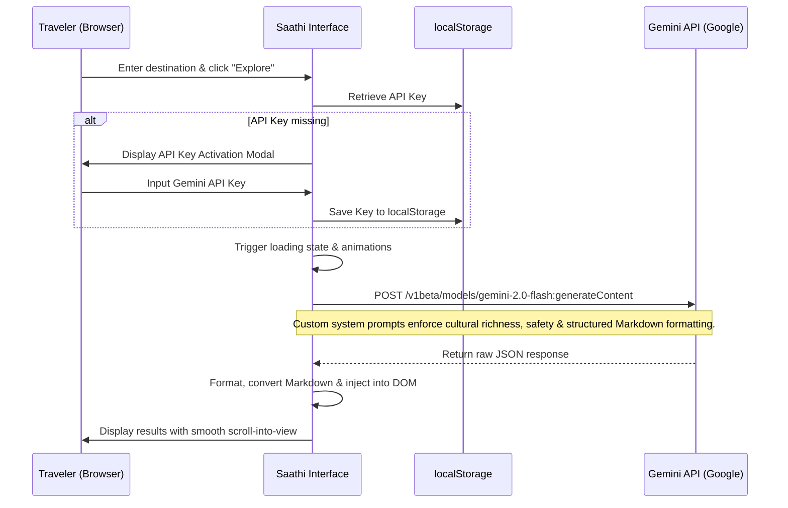

# Saathi: Your Traveller Companion

Saathi is a premium, GenAI-powered single-page application (SPA) designed to help travelers discover destinations and engage deeply with local cultures. The platform bridges the gap between generic sightseeing and authentic cultural immersion, acting as a personal, intelligent companion for the modern explorer.

---

## 📌 Problem Statement
Many travelers visit famous locations without understanding their underlying history, local customs, or cultural significance. Standard travel guides often prioritize commercial spots, leaving hidden gems unnoticed, heritage traditions unappreciated, and local communities disconnected from visitors. 

**Objective**: Build a GenAI-powered platform that:
- Uncovers off-the-beaten-path hidden gems.
- Generates immersive, historical, and mythological storytelling.
- Promotes local heritage, ancient arts, and traditional cuisines.
- Suggests authentic local events, workshops, and seasonal activities.
- Connects travelers directly with authentic local experiences.
- Simplifies travel planning through intelligent itinerary builders, side-by-side comparison matrices, and cultural etiquette guides.

---

## 💡 Proposed Solution: Saathi
**Saathi** (meaning *Companion* in Hindi) is a comprehensive, client-side application that utilizes generative AI to deliver instant, customized cultural insights. Built around a modern **dark glassmorphism design system**, Saathi provides a highly interactive and engaging user experience that works straight from the browser.

### 🌟 Core AI-Powered Modules
1. **AI Destination Discovery**: Generates a complete cultural guide, covering top attractions, food culture, local language tips, best travel periods, and essential tips.
2. **Hidden Gems Finder**: Surfaces secret trails, local eateries, and authentic villages far from standard tourist crowds, categorized by nature, history, food, and arts.
3. **Immersive Storytelling**: Narrates vivid historical legends, folklore, culinary origins, and spiritual tales associated with destinations, using custom narrative styles (e.g., epic, mystical, historical, culinary).
4. **Heritage Spotlight**: Offers interactive tabs diving deep into UNESCO heritage sites, traditional arts, local gastronomy, spiritual practices, and folk music.
5. **Local Events & Activities**: Recommends cultural workshops, traditional festivals, and community markets based on the traveler's visit month and interests.
6. **Authentic Experiences Connector**: Connects travelers to authentic experiences such as homestays, cooking masterclasses, craft workshops, and guided neighborhood walks.
7. **Destination Comparison Matrix**: Evaluates two destinations side-by-side across cultural depth, accessibility, cost, climate, safety, and local culinary scenes.
8. **Cultural Itinerary Builder**: Generates tailored day-by-day plans adjusted for pace (relaxed vs. fast-paced), travel group style (solo, family, couple, friends), and duration.
9. **Cultural Etiquette Guide**: Outlines essential cultural do’s and don’ts, respectful dress codes, basic greetings, and dining practices to help travelers show respect.

---

## 🛠️ Technology Stack

### 🧠 Generative AI Engine
- **Google Gemini API (`gemini-2.0-flash`)**: Used for all generative content, structured output generation, translation, and interactive suggestions.
- **Client-Side REST Architecture**: Fetches data asynchronously directly from Google AI Studio services via secure HTTP headers.
- **Local Storage Caching**: Safely stores the user's API Key and recent destination search history directly in the browser's `localStorage`.

### 🖥️ Frontend & Design
- **HTML5**: Semantic web structure optimized for SEO, metadata compatibility, and browser access.
- **CSS3 (Custom Design System)**:
  - **Glassmorphism**: Glass-like frosted components utilizing `backdrop-filter: blur(20px)` and semi-transparent border lines.
  - **Aesthetics**: Premium deep navy background (`#080b14`), neon indigo and purple gradients (`#6c63ff` to `#a855f7`), and warm golden accent colors (`#f4a732`).
  - **Visual Elements**: Integrated animated floating canvas particles, slide-in headers, responsive navigation panels, and interactive tabs.
- **Vanilla JavaScript (ES6+)**: Handles all state variables, dynamic DOM rendering, event list handling, Gemini API query compilation, dynamic CSS theme triggers, and UI layout logic.
- **Google Fonts**: Uses *Inter* for clean UI readability, *Playfair Display* for classic titles, and *DM Serif Display* for storytelling texts.

---

## 📁 Repository Structure
The project files are segregated into clean, standard folders:

```
saathi-companion/
├── index.html          # Main SPA (Single Page Application) entrypoint
├── package.json        # Project metadata and local CLI dev dependencies
├── README.md           # Core documentation (this file)
├── .gitignore          # Git exclusion rules
├── css/
│   └── style.css       # Clean stylesheet detailing glassmorphism design tokens & styles
├── js/
│   └── app.js          # Main script compiling UI handlers and Gemini API calls
└── assets/
    ├── hero_travel_bg.jpg      # Premium high-resolution hero background image
    └── culture_pattern.jpg     # Repeating pattern image used in storytelling background
```

---

## ⚙️ Working Methodology & Architecture
Saathi operates on a serverless, direct-to-API model. This architecture removes intermediate database delays, keeping responses exceptionally fast.



### 🔒 Security and Privacy
1. **API Keys**: No API key is ever uploaded to a third-party server. All key transmissions go directly from the client’s browser to Google’s API endpoint (`https://generativelanguage.googleapis.com`).
2. **Local Storage**: The API key is stored locally and can be cleared at any time by clicking the status indicator in the bottom-left corner of the application.

---

## 🚀 Setup & Installation

### Local Execution (No installation needed)
1. Clone the repository:
   ```bash
   git clone https://github.com/atharali786/saathi-companion.git
   ```
2. Navigate to the project folder:
   ```bash
   cd saathi-companion
   ```
3. Open `index.html` directly in any web browser.

### Development Mode (with Netlify CLI)
1. Install local dependencies:
   ```bash
   npm install
   ```
2. Start Netlify dev server locally:
   ```bash
   npx netlify dev
   ```
   *This starts the server locally, enabling quick testing of Netlify configurations.*
